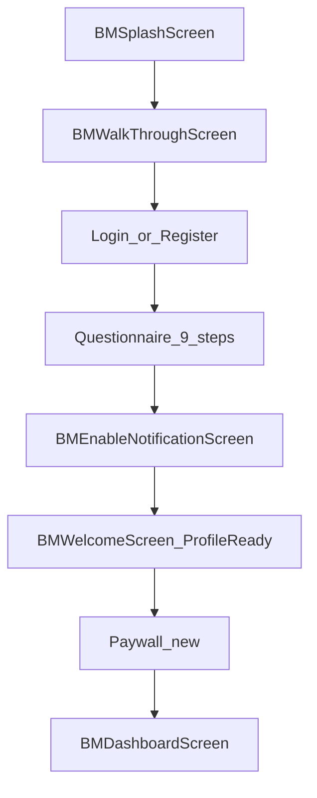

# Template → Verified Glam screen mapping

Maps the **existing Beauty Master Flutter UI shell** to **Verified Glam** content and flows. Preserve layout, colors, and walkthrough photography per [DESIGN_SYSTEM_LOCKED.md](DESIGN_SYSTEM_LOCKED.md).

**Competitor UI reference:** Component patterns (not colors/branding) per [HYBRID_DESIGN_RULES.md](HYBRID_DESIGN_RULES.md). Screenshot filenames point to [reference/competitor-screenshots/](reference/competitor-screenshots/README.md).

**Legend:** **Keep shell** = reuse widget structure; **Content swap** = change strings/data/navigation targets only.

---

## App entry and onboarding

| Template file | Keep shell | Verified Glam content / behavior | Competitor ref |
|---------------|------------|----------------------------------|----------------|
| `lib/screens/BMSplashScreen.dart` | Yes | App name **Verified Glam**, slogan *Beauty Made Perfect*; `verified_glam_logo.png`; 3s → walkthrough | — |
| `lib/screens/BMWalkThroughScreen.dart` | **Yes — critical** | Keep `model_one/two/three.jpg` full-bleed `PageView`; replace titles/subtitles with carousel copy (Pretty Up Now, Discover Your Features, Built By Experts); Skip → main or onboarding; Login / Join → auth | **No competitor imagery** |
| `lib/screens/BMLoginScreen.dart` | Yes | Email/password + Google (Convex Auth); keep `upperContainer` + form layout | — |
| `lib/screens/BMRegisterScreen.dart` | Yes | Sign-up; link to login | — |
| `lib/screens/BMForgetPasswordScreen.dart` | Yes | Password reset flow | — |
| `lib/screens/BMChangePasswordScreen.dart` | Yes | Post-reset confirmation | — |
| `lib/screens/BMLoginNowScreen.dart` | Yes | Success state after auth | — |
| `lib/screens/BMEnableLocationScreen.dart` | Repurpose | **Skip or repurpose** — Verified Glam spec has no location step; use for extra onboarding step or remove from flow | — |
| `lib/screens/BMEnableNotificationScreen.dart` | Yes | “Allow Notifications” + FCM token save | `20-allow-notifications.png` |
| `lib/screens/BMWelcomeScreen.dart` | Yes | **Profile ready** — three benefit cards, “Get started” → paywall or home | `19-account-ready.png` |
| *New: gender* | Hybrid | Single-select pill list | `09-gender.png` |
| *New: beauty goals* | Hybrid | Multi-select rows + Continue | `10-beauty-goals.png` |
| *New: skin type(s)* | Hybrid | Selection lists | `11-skin-type.png`, `12-skin-types.png` |
| *New: aesthetic* | Hybrid | Photo carousel + Select | `13-aesthetic-look-type.png` |
| *New: favorite products* | Hybrid | Product preferences | `15-favorite-products.png` |
| *New: rating* | Hybrid | Store review prompt | `21-leave-a-review.png` |
| *New: processing setup* | Hybrid | “Setting everything up” loader | `18-setting-everything.png` |
| *New: paywall* | Hybrid | Subscription UI | `23-paywall-dark.png`, `24-paywall-promo-overlay.png` |

### Onboarding flow (target)

---

## Main shell (dashboard)

| Template file | Tab index | Keep shell | Verified Glam content | Competitor ref |
|---------------|-----------|------------|------------------------|----------------|
| `lib/screens/BMDashboardScreen.dart` | — | Yes | **4 tabs:** Home, Scan, Explore, Guide; profile/settings via header gear | — |
| `lib/fragments/BMHomeFragment.dart` | 0 | Yes | Featured carousel + analysis grid | `01`–`03` |
| `lib/fragments/vg_scans_fragment.dart` | 1 | New | Scan history + empty state | `05-scans-empty.png` |
| `lib/fragments/vg_explore_fragment.dart` | 2 | New | All 11 analyses | — |
| `lib/fragments/vg_guide_fragment.dart` | 3 | New | Tips + seven-day routine entry | — |
| `lib/fragments/BMChatFragment.dart` | 3 | TBD | **Defer** — repurpose as Tips, support, or hide tab |
| `lib/fragments/BMMoreFragment.dart` | 4 | Yes | **Settings / profile** — subscription, legal, theme toggle (keep) | `07-settings-sheet.png` |

---

## Home and discovery (salon → features)

| Template file | Keep shell | Verified Glam content |
|---------------|------------|------------------------|
| `lib/components/BMHomeFragmentHeadComponent.dart` | Yes | Header: logo + settings gear; greeting copy |
| `lib/components/BMTopServiceHomeComponent.dart` | Yes | Horizontal **feature** chips (Color Analysis, Glow Up, Face Analysis) |
| `lib/components/BMMyMasterComponent.dart` | Repurpose | **Featured scans** or remove section |
| `lib/components/BMCommonCardComponent.dart` | Yes | **Feature / scan promo cards** — title, description, HOT/NEW badge, “Start scan” |
| `lib/screens/BMTopOffersScreen.dart` | Yes | “See all” features list |
| `lib/screens/BMRecommendedScreen.dart` | Yes | Secondary feature list or recommendations |
| `lib/screens/BMSingleComponentScreen.dart` | Yes | Feature detail / pre-scan info |
| `lib/components/BMSearchListComponent.dart` | Optional | Search features (if needed) |

---

## Scan pipeline (replaces booking/calendar)

| Template file | Original template use | Verified Glam use |
|---------------|----------------------|---------------------|
| `lib/screens/BMCalenderScreen.dart` | Salon booking calendar | **Do not use for booking** — repurpose layout for **photo guidelines** or remove |
| `lib/components/BMCalenderComponent.dart` | Date picker | Repurpose or delete |
| `lib/utils/BMBottomSheet.dart` | Booking/comments | Repurpose for scan options / share |
| `lib/screens/BMShoppingScreen.dart` | Product cart | Results products / affiliate (optional) |
| *Future* `PhotoGuidelinesScreen` | — | Do’s/don’ts, good/bad examples | `17-upload-scan-rules.png` |
| *Future* `PhotoUploadScreen` | — | Camera / gallery picker | `16-upload-or-take-pic.png`, `08-scan-face-camera.png` |
| *Future* `ProcessingScreen` | — | Dark UI + wireframe animation + “Analyzing…” | `18-setting-everything.png`, `alt-02-face-score-onboarding.png` |
| *Future* `ResultsScreen` | — | Scores, breakdown, share; banner ad if free |

**Reuse candidates for results layout:** `BMSinglePortfolioScreen`, `BMSingleImageScreen`, score widgets in cards.

---

## Social / communication (optional)

| Template file | Verified Glam |
|---------------|---------------|
| `lib/fragments/BMChatFragment.dart` | Low priority — not in core spec |
| `lib/screens/BMChatScreen.dart` | Optional support chat placeholder |
| `lib/screens/BMCallScreen.dart` | **Remove** from flow |
| `lib/components/BMCommentComponent.dart` | Optional reviews / tips comments |

---

## Profile, favorites, map

| Template file | Verified Glam |
|---------------|---------------|
| `lib/screens/BMFavouritesScreen.dart` | Saved scans or favorite features |
| `lib/screens/BMMapScreen.dart` | **Not in spec** — remove FAB map entry or repurpose |
| `lib/components/BMFloatingActionComponent.dart` | Remove map FAB or replace with quick scan |

---

## Auth UI components

| Template file | Verified Glam |
|---------------|---------------|
| `lib/components/BMSocialIconsLoginComponents.dart` | Google + social row for Convex Auth |

---

## Data layer mapping

| Template | Verified Glam |
|----------|---------------|
| `lib/utils/BMDataGenerator.dart` | Replace mock salons with `FEATURES` list, scan types, onboarding options |
| `lib/models/BMCommonCardModel.dart` | Extend → `FeatureCardModel` (badge, featureType, isPro) |
| `lib/models/BMAppointmentModel.dart` | → `ScanHistoryModel` |
| `lib/store/AppStore.dart` | Keep for theme; add Convex/subscription stores later |

---

## Navigation summary

| Current flow | Target flow |
|--------------|-------------|
| Splash → Walkthrough → Login/Register → Location → Notification → Welcome → Dashboard | Splash → Walkthrough → Auth → Questionnaire → Notification → Profile ready → Paywall → Dashboard |
| Home card tap → Salon detail → Calendar booking | Home feature tap → Guidelines → Upload → Process → Results |
| Appointments tab → booking list | Scans tab → history |
| More → settings | More → settings + subscription |

---

## Open product decisions

Record decisions here as they are made:

| # | Question | Options | Decision |
|---|----------|---------|----------|
| 1 | Tab 1 slot | Scans vs Explore vs Search | _TBD_ |
| 2 | Chat tab (index 3) | Keep / Tips / Remove | _TBD_ |
| 3 | Map FAB | Remove / Quick scan | _TBD_ |
| 4 | Logo asset | Owner-provided `verified_glam_logo.png` | Done |
| 5 | Location screen | Skip vs repurpose | _TBD_ |

---

## Related docs

- [DESIGN_SYSTEM_LOCKED.md](DESIGN_SYSTEM_LOCKED.md)
- [VERIFIED_GLAM_PRODUCT.md](VERIFIED_GLAM_PRODUCT.md)
- [DEVELOPMENT_ROADMAP.md](DEVELOPMENT_ROADMAP.md)
