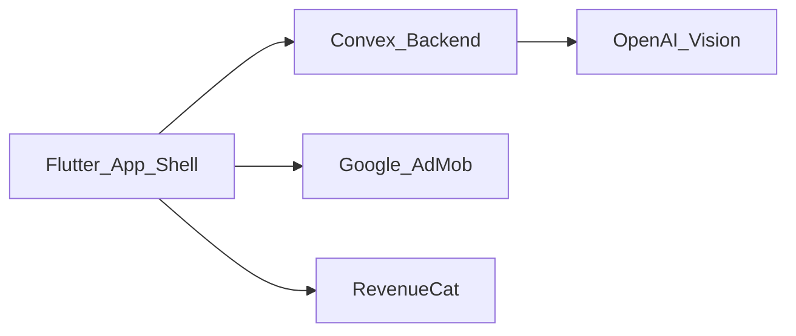

# Verified Glam — Product Summary

Condensed product specification for development. **Full detail:** [source/VERIFIED_GLAM_FULL_SPEC.md](source/VERIFIED_GLAM_FULL_SPEC.md).

**UI shell:** Flutter Beauty Master template (this repo). **Do not** treat the full spec’s React Native stack as the implementation target unless explicitly migrating.

---

## Identity

| Property | Value |
|----------|--------|
| App name | **Verified Glam** |
| Slogans | Beauty Made Perfect · Pretty in Every Way · Your Perfect Pretty Glow |
| Platform | Android (Google Play) |
| Audience | Women & beauty-conscious users, 16–45 |
| Model | Freemium — ads + Pro subscription |

---

## Value proposition

AI-powered beauty analysis: facial scoring, personalized insights, multiple scan types, tutorials and recommendations. Differentiator: combined feature set with actionable, confidence-oriented results (vs. shallow competitor apps).

---

## Architecture (target)

| Layer | Technology |
|-------|------------|
| Mobile UI | **Flutter** (existing template) — not React Native from original doc |
| Auth & data | **Convex** (auth, database, file storage) |
| AI | **OpenAI GPT-4 Vision** via Convex functions only — **never** API key in app |
| Ads | Google AdMob (banner + interstitial) |
| Subscriptions | RevenueCat |
| Push | FCM / Convex-triggered notifications |

---

## Core user flows

### First launch

1. Splash (~2.5–3s)
2. Welcome carousel (3 slides) — **keep template model images**, Verified Glam copy
3. Onboarding questionnaire (9 steps): age, gender, beauty goals, skin concerns, product prefs, skin type, ethnicity, aesthetic
4. Rating prompt (optional)
5. Notifications permission
6. Profile setup / “Profile ready”
7. Paywall (can dismiss)

### Returning user

Auth check → subscription check → main app (ads if free).

### Scan flow (every feature)

1. Tap feature on home
2. Pro gate if premium feature + free user → paywall
3. Photo guidelines (do’s / don’ts)
4. Upload or camera selfie
5. Processing screen (animation)
6. OpenAI via Convex
7. Interstitial ad (free only) → results
8. Save to scan history

---

## Main app areas

| Area | Purpose |
|------|---------|
| **Home** | Greeting, horizontal feature carousel, 2-column feature grid, settings entry |
| **Scans** | History list or empty state |
| **Settings / More** | Profile, subscription, legal, support, theme toggle (existing template) |

Original spec used 2 tabs; template has 5 — see `TEMPLATE_TO_VERIFIED_GLAM_MAP.md`.

---

## Features (11)

| Feature | Free | Pro | Notes |
|---------|------|-----|--------|
| Face Beauty Analysis | Basic | Full detail | Core |
| Best Face Part | Yes | — | |
| Beauty Tips | Limited | Full + products | |
| Celebrity Look-Alike | — | Yes | HOT badge |
| Facial Symmetry | — | Yes | NEW badge |
| Beauty Score Showdown | — | Yes | HOT badge |
| Facial Resemblance | — | Yes | Two photos |
| Face Reading | — | Yes | Entertainment disclaimer |
| Golden Ratio Score | — | Yes | |
| Color Analysis | — | Yes | Season + palette |
| Glow Up Guide | — | Yes | 7-day plan |

---

## Monetization

### Free tier

- Basic scans + ads (banner on home/scans; **interstitial before results**)
- Scan history cap (e.g. 10 saves)

### Pro tier (RevenueCat)

- No ads, all features, unlimited history
- Plans (from spec): weekly, monthly, annual; 3-day trial on weekly
- Paywall triggers: post-onboarding, pro feature tap, every 3 free uses/session, daily prompt cap

### Ad placement (free)

| Moment | Type |
|--------|------|
| After processing, before results | Interstitial (primary revenue) |
| Home / scan history | Banner |
| Preload interstitial during processing | Recommended |

---

## Backend essentials

### User document (Convex / equivalent)

- Profile: age, gender, goals, concerns, preferences, skin type, ethnicity, aesthetic, onboarding flag
- Subscription: isPro, plan, expiry, RevenueCat id
- Stats: total scans, last scan
- FCM token

### Scan document

- featureType, imageUrl, thumbnail, results JSON, createdAt

### Cloud functions (callable)

- `analyzeBeauty(image, featureType, profile)`
- `saveAnalysisResult`, `getUserScans`, `deleteScan`
- `updateUserProfile`, `getLeaderboard` (showdown)

### Security

- `OPENAI_API_KEY` only on server
- Env: Convex project, AdMob IDs, RevenueCat keys — not committed

---

## Onboarding copy reference (for future string swap)

| Slide / step | Headline / theme |
|--------------|------------------|
| Carousel 1 | Pretty Up Now |
| Carousel 2 | Discover Your Features |
| Carousel 3 | Built By Experts → Get Started |
| Home | Ready to Glam Up? / Choose a scan to start |

---

## Play Store (summary)

- Category: Lifestyle / Beauty
- Permissions: camera, storage, internet, notifications
- Privacy policy must cover photos, Convex, AdMob, deletion, age 13+
- Full listing text in full spec §19

---

## Development phases

See [DEVELOPMENT_ROADMAP.md](DEVELOPMENT_ROADMAP.md) for Flutter-adapted milestones.

---

## Document index

| File | Role |
|------|------|
| [DESIGN_SYSTEM_LOCKED.md](DESIGN_SYSTEM_LOCKED.md) | Locked UI/UX |
| [TEMPLATE_TO_VERIFIED_GLAM_MAP.md](TEMPLATE_TO_VERIFIED_GLAM_MAP.md) | Screen mapping |
| [DEVELOPMENT_ROADMAP.md](DEVELOPMENT_ROADMAP.md) | Phased build plan |
| [source/VERIFIED_GLAM_FULL_SPEC.md](source/VERIFIED_GLAM_FULL_SPEC.md) | Complete original specification |

*Product digest v1.0 — aligned with full spec May 2026.*
